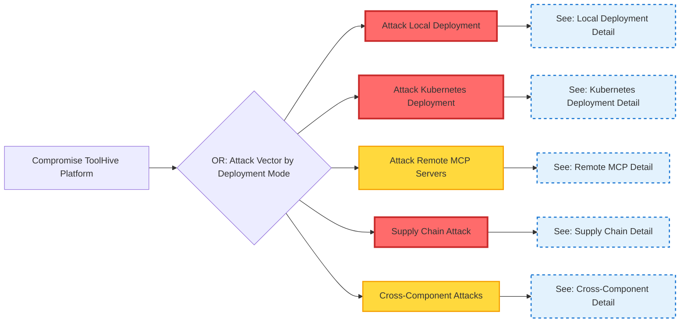
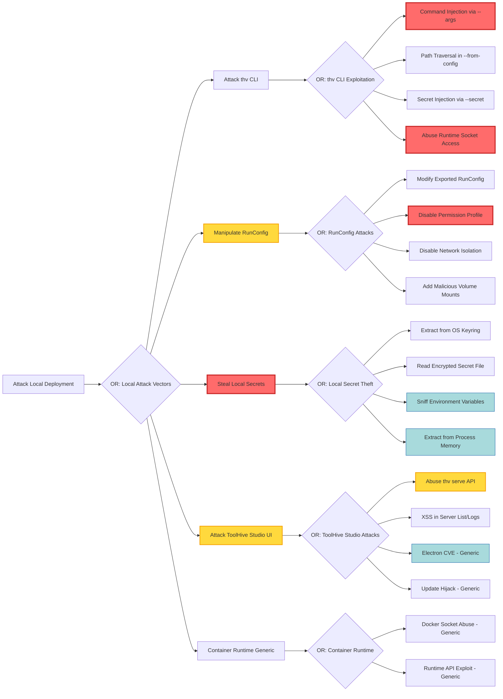
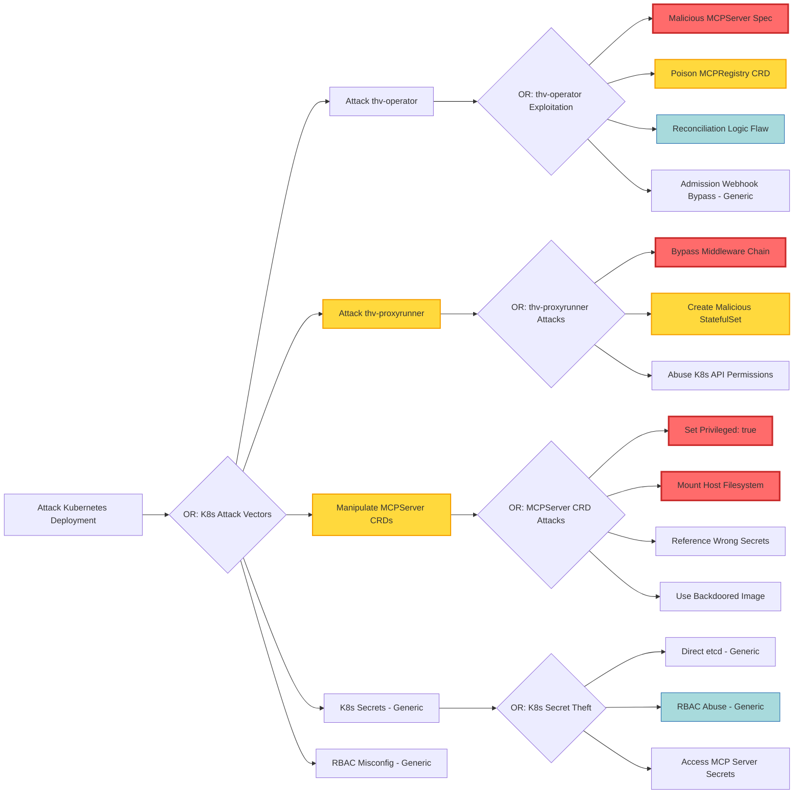
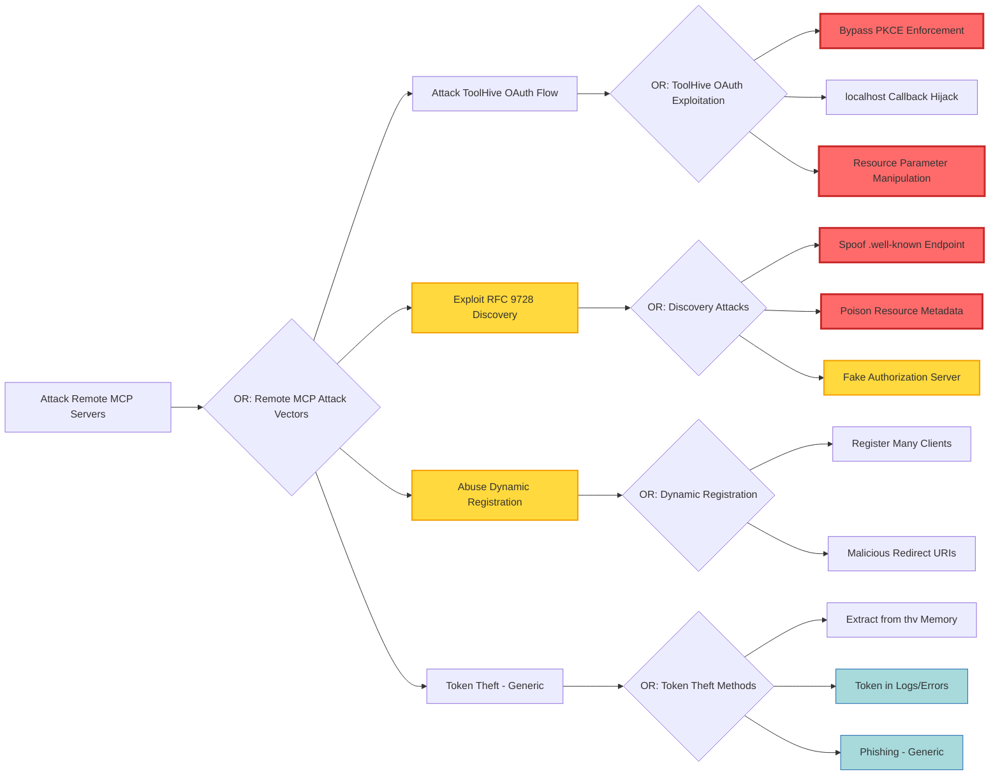
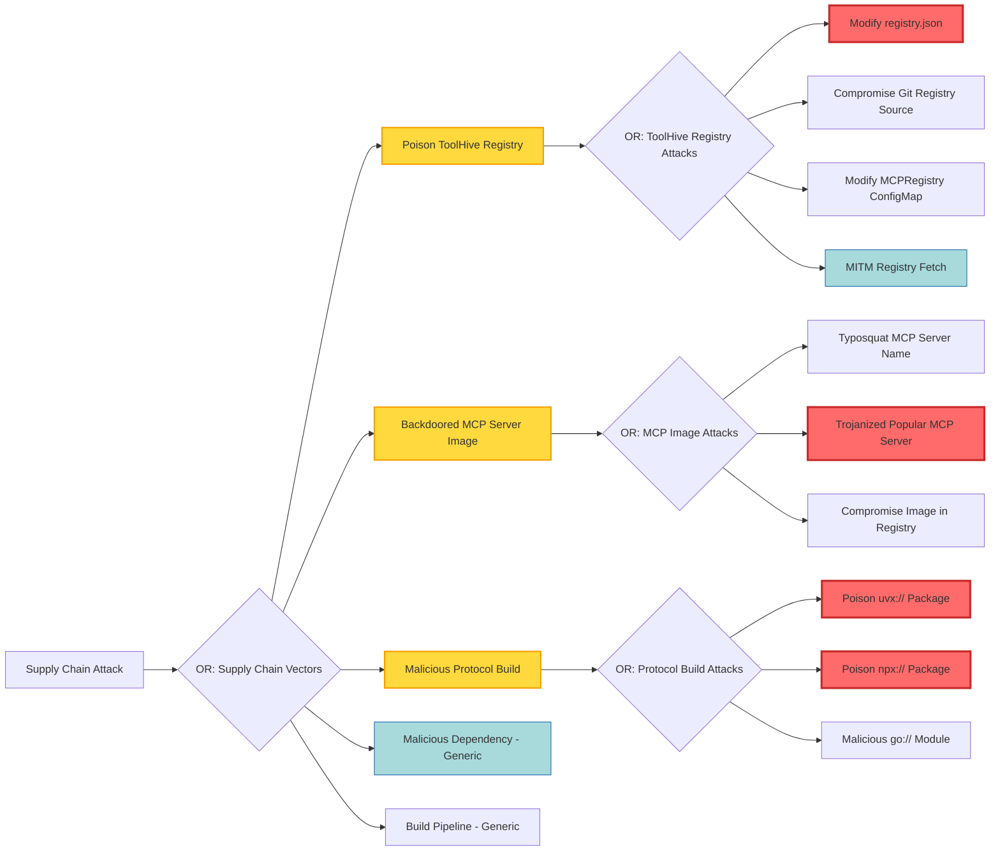
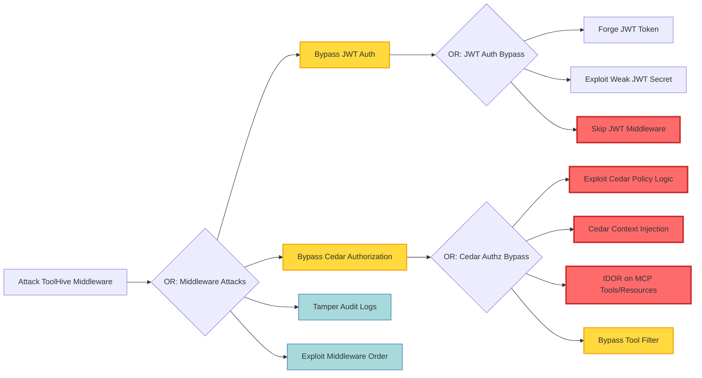
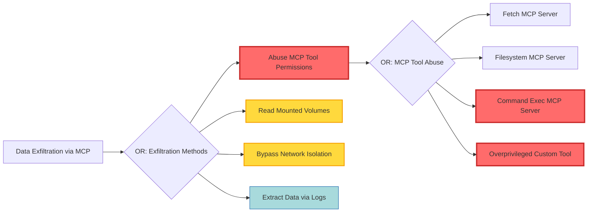
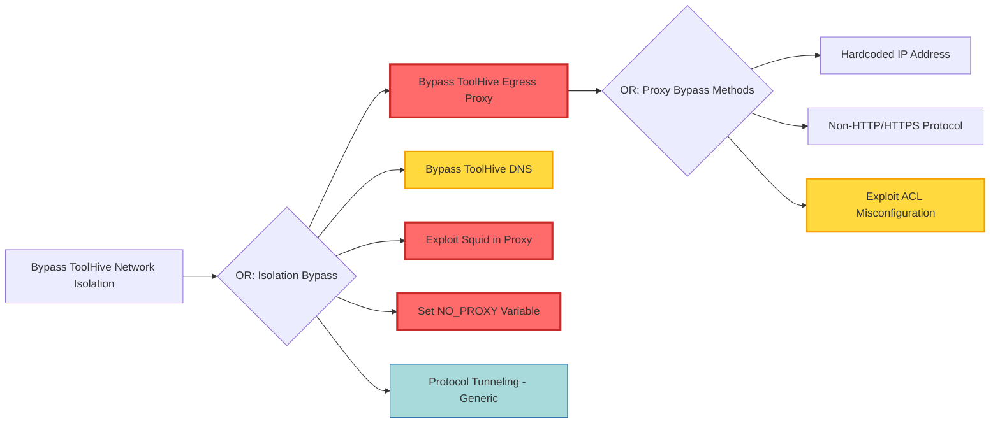

# ToolHive Attack Tree

This attack tree models the potential attack vectors against the ToolHive platform across its different deployment modes and components. It serves as a structured approach to understanding security threats and implementing appropriate countermeasures.

## Root Goal: Compromise ToolHive Platform

### High-Level Attack Vectors

This overview shows the main attack categories. Click through to detailed sections below for specific attack paths.

---

## Detailed Attack Trees by Category

### 1. Local Deployment Attacks

Attacks targeting CLI and Desktop UI deployments running on user workstations.

**ToolHive-Specific Elements**: RunConfig manipulation, MCP proxy abuse, permission profile bypass, ToolHive API exploitation

**Generic Infrastructure Elements**: Container runtime vulnerabilities, OS-level secret theft (apply to any containerized app)

**Related Documentation**:

- [Architecture: Deployment Modes](../arch/01-deployment-modes.md)
- [Secrets Management Architecture](../arch/04-secrets-management.md)
- [RunConfig and Permissions](../arch/05-runconfig-and-permissions.md)

### 2. Kubernetes Deployment Attacks

Attacks targeting Kubernetes operator deployments in cluster environments.

**ToolHive-Specific Elements**: MCPServer CRD manipulation, thv-operator exploitation, thv-proxyrunner abuse, ToolHive RBAC

**Generic Infrastructure Elements**: etcd access, generic RBAC misconfig, pod security (apply to any K8s operator)

**Related Documentation**:

- [Kubernetes Operator README](../../cmd/thv-operator/README.md)
- [Operator Architecture](../arch/09-operator-architecture.md)
- [MCPServer CRD API Reference](../operator/crd-api.md)

### 3. Remote MCP Server Attacks

Attacks targeting ToolHive's OAuth/OIDC authentication flows and remote MCP server connections.

**ToolHive-Specific Elements**: RFC 9728 discovery exploitation, dynamic registration abuse, resource parameter manipulation

**Generic Infrastructure Elements**: Standard OAuth vulnerabilities (apply to any OAuth client)

**Related Documentation**:

- [Remote MCP Authentication](../remote-mcp-authentication.md)
- [Authorization Framework](../authz.md)

### 4. Supply Chain Attacks

Attacks targeting ToolHive's software supply chain, from MCP registries to build pipelines.

**ToolHive-Specific Elements**: MCP registry manipulation, MCPRegistry CRD poisoning, protocol builds (uvx://, npx://, go://)

**Generic Infrastructure Elements**: Standard supply chain attacks (apply to any software)

**Related Documentation**:

- [Registry System Architecture](../arch/06-registry-system.md)
- [Registry Documentation](../registry/)
- [MCPRegistry CRD](../../cmd/thv-operator/REGISTRY.md)

### 5. Cross-Component Attacks

Attacks that span multiple components, including ToolHive's middleware, MCP tool abuse, and network isolation bypass.

**ToolHive-Specific Elements**: Cedar policy exploitation, MCP tool permission abuse, ToolHive egress proxy bypass

**Generic Infrastructure Elements**: Standard auth bypass, generic network attacks

#### 5.1 Middleware Chain Attacks

**Related Documentation**:

- [Middleware Architecture](../middleware.md)
- [Authorization Framework (Cedar)](../authz.md)

#### 5.2 Data Exfiltration via MCP Tools

**Related Documentation**:

- [RunConfig and Permissions](../arch/05-runconfig-and-permissions.md)

#### 5.3 ToolHive Network Isolation Bypass

**Related Documentation**:

- [Runtime Implementation Guide (Network Isolation)](../runtime-implementation-guide.md)

---

## Legend

### Node Types

- **Root Node**: Main objective of attack (Compromise ToolHive Platform)
- **{OR}**: Any one child path is sufficient to achieve parent goal
- **{AND}**: All child paths must succeed to achieve parent goal
- **(Leaf Nodes)**: Specific attack techniques or actions

### Attack Specificity

- **ToolHive-Specific**: Attacks that exploit ToolHive's unique features, architecture, or implementation
  - Examples: MCPServer CRD manipulation, Cedar policy bypass, RunConfig tampering, RFC 9728 discovery exploitation, protocol builds (uvx://, npx://, go://)
- **Generic Infrastructure**: Standard attacks applicable to any system using similar technology (labeled with "- Generic" suffix in diagrams)
  - Examples: etcd access (any K8s app), Docker socket abuse (any container platform), standard OAuth phishing

### Risk Classification

- 🔴 **High Risk (Red)**: Critical impact, leads to full system compromise or secret exposure
- 🟡 **Medium Risk (Yellow)**: Significant impact, may lead to partial compromise or privilege escalation
- 🔵 **Low Risk (Blue)**: Limited impact, requires additional exploitation steps

## Attack Cost Estimates (ToolHive-Specific)

The following table provides estimated costs (attacker effort) and potential impact for key **ToolHive-specific** attack paths. Generic infrastructure attacks (e.g., etcd access, container escape) are excluded.

| Attack Path | Cost | Impact | Target Asset | Prerequisites |
|-------------|------|--------|--------------|---------------|
| **RunConfig Manipulation** | | | | |
| Modify Exported RunConfig | Low | High | Workload configuration | File system access to exported config |
| Disable Permission Profile | Low | Critical | MCP server restrictions | Access to RunConfig before `thv run` |
| Add Malicious Volume Mounts | Low | Critical | Host file system | Ability to modify RunConfig |
| Disable Network Isolation | Low | High | Network restrictions | Access to RunConfig |
| **ToolHive CLI Exploitation** | | | | |
| Command Injection via --args | Medium | Critical | Code execution in container | Craft malicious CLI arguments |
| Path Traversal in --from-config | Medium | High | Read arbitrary files | Control config file path |
| Secret Injection via --secret | Low | Medium | Inject fake secrets | Craft malicious secret references |
| **MCPServer CRD Attacks** | | | | |
| Set Privileged: true in CRD | Low | Critical | Full node compromise | K8s API write for MCPServer CRD |
| Mount Host Filesystem via CRD | Low | Critical | Host data access | K8s API write for MCPServer CRD |
| Reference Wrong Secrets | Low | Medium | Cross-namespace secret access | K8s API write + RBAC misconfig |
| Use Backdoored MCP Image | Medium | Critical | Container compromise | Control image field in CRD |
| **thv-operator Exploitation** | | | | |
| Malicious MCPServer Spec Injection | Medium | Critical | Deploy malicious workload | K8s API write for MCPServer |
| Poison MCPRegistry CRD | Medium | High | Distribute malware | K8s API write for MCPRegistry |
| Reconciliation Logic Flaw | Very High | Medium | Bypass validation | Find operator bug |
| **thv-proxyrunner Attacks** | | | | |
| Bypass Middleware Chain | High | Critical | Skip auth/authz/audit | Exploit proxy logic flaw |
| Create Malicious StatefulSet | Medium | High | Deploy backdoored MCP server | Compromise proxy runner pod |
| Abuse K8s API Permissions | Medium | High | Cluster-wide access | Exploit proxy RBAC permissions |
| **Cedar Authorization Bypass** | | | | |
| Exploit Cedar Policy Logic | Medium | High | Access unauthorized tools | Find policy logic flaw |
| Cedar Context Injection | High | Critical | Forge authorization context | Inject claims/arguments |
| Bypass Tool Filter | Low | Medium | Access filtered tools | Exploit filter logic |
| IDOR on MCP Tools/Resources | Low | Medium | Access other users' MCP tools | Predictable tool IDs |
| **ToolHive OAuth/OIDC Attacks** | | | | |
| Bypass PKCE Enforcement | High | Critical | Session hijacking | Find PKCE validation bug |
| localhost Callback Hijack | Medium | High | Steal authorization code | Local network access |
| Resource Parameter Manipulation | Medium | Medium | Access wrong resources | Manipulate RFC 8707 parameter |
| Spoof .well-known Endpoint | High | Critical | Fake auth server | MITM or DNS control |
| Poison Resource Metadata | High | Critical | Redirect to malicious issuer | MITM RFC 9728 discovery |
| **ToolHive Registry Attacks** | | | | |
| Modify registry.json | Low | Critical | Distribute malware | File system or git access |
| Poison MCPRegistry ConfigMap | Low | Critical | K8s cluster-wide malware | K8s ConfigMap write access |
| Typosquat MCP Server Name | Medium | High | Trick users to install | Register similar name |
| Trojanize Popular MCP Server | High | Critical | Widespread compromise | Compromise popular image |
| **Protocol Build Attacks** | | | | |
| Poison uvx:// Package | Medium | Critical | Python package compromise | PyPI access or MITM |
| Poison npx:// Package | Medium | Critical | npm package compromise | npm registry access |
| Malicious go:// Module | Medium | High | Go module compromise | Control go module |
| **ToolHive Network Isolation** | | | | |
| Bypass ToolHive Egress Proxy | Medium | High | Unrestricted network | Non-HTTP protocol or direct IP |
| Set NO_PROXY Variable | Low | High | Disable proxy | Environment variable injection |
| Bypass ToolHive DNS | Medium | High | DNS resolution bypass | Hardcoded IPs in MCP server |
| Exploit Squid in ToolHive Proxy | High | Critical | Proxy compromise | Unpatched Squid CVE |
| **ToolHive Studio (Desktop UI)** | | | | |
| Abuse thv serve API | Medium | High | Control all local workloads | Access to API server port |
| XSS in Server List/Logs | Low | Medium | Client-side code execution | Inject HTML in server names/logs |

### Cost Levels

- **Low**: Hours to days, script kiddie capability
- **Medium**: Days to weeks, requires specialized knowledge
- **High**: Weeks to months, requires advanced expertise
- **Very High**: Months+, requires deep expertise and/or insider access

### Impact Levels

- **Medium**: Limited scope, affects single workload/user
- **High**: Affects multiple workloads/users, partial system compromise
- **Critical**: Full system compromise, complete data access, persistent control

## Key Attack Chains (ToolHive-Specific)

### Chain 1: RunConfig Tampering to Host Compromise

**ToolHive-Specific**: Exploits RunConfig portability and permission profiles

1. User exports MCP server config: `thv export server1 config.json`
2. Attacker modifies RunConfig to disable permission profile
3. Attacker adds volume mount: `"volumes": ["/:/host:rw"]`
4. User imports and runs: `thv run --from-config config.json`
5. MCP server has full host filesystem access

**Mitigations**:

- Validate RunConfig signatures before import
- Warn users when importing configs with privileged settings
- Implement RunConfig schema validation with security checks

### Chain 2: MCPRegistry Poisoning to Cluster Compromise

**ToolHive-Specific**: Exploits MCPRegistry CRD and auto-sync

1. Attacker gains write access to MCPRegistry ConfigMap or Git source
2. Modifies registry.json to point popular MCP server to backdoored image
3. MCPRegistry controller syncs poisoned data
4. Users run infected server: `thv run popular-mcp-server`
5. Malicious container deployed across cluster with normal permissions
6. Backdoor exfiltrates data or escalates privileges

**Mitigations**:

- Implement registry signing with Sigstore/Cosign
- ConfigMap write access tightly controlled (RBAC)
- Image scanning before deployment
- Git commit signing required for registry sources

### Chain 3: Cedar Policy Bypass to Unauthorized MCP Access

**ToolHive-Specific**: Exploits Cedar context injection

1. Attacker analyzes Cedar policies for authorization logic
2. Finds policy: `permit when { context.claim_role == "admin" }`
3. Crafts MCP request with injected context/claims
4. Exploits middleware ordering to skip JWT validation
5. Bypasses Cedar authorization checks
6. Accesses restricted MCP tools without valid auth

**Mitigations**:

- Validate all context sources in Cedar policies
- Immutable middleware chain ordering
- Never trust client-provided context without signature
- Policy testing framework for edge cases

### Chain 4: RFC 9728 Discovery Exploitation to MITM

**ToolHive-Specific**: Exploits ToolHive's RFC 9728 well-known URI discovery

1. User attempts to connect to remote MCP: `thv run https://mcp.example.com`
2. Attacker performs MITM on network
3. Intercepts `GET /.well-known/oauth-protected-resource`
4. Returns malicious metadata pointing to attacker's auth server
5. ToolHive performs OAuth flow with attacker's server
6. Attacker captures user credentials and tokens

**Mitigations**:

- Certificate pinning for well-known endpoints
- Require DNSSEC validation
- Warn users about untrusted OAuth issuers
- Manual issuer override: `--remote-auth-issuer` flag

### Chain 5: Protocol Build Supply Chain Attack

**ToolHive-Specific**: Exploits uvx://npx://go:// protocol builds

1. Attacker typosquats popular MCP server package
2. Uploads to PyPI: `uvx://mcp-servr` (note typo)
3. User runs: `thv run uvx://mcp-servr` (typo in command)
4. ToolHive builds container from malicious package
5. Malicious code executes during build or runtime
6. Backdoor establishes persistence and exfiltrates data

**Mitigations**:

- Package name validation and typosquat detection
- Sandbox protocol builds in separate environment
- Display package source prominently before build
- Warn on first-time package usage

### Chain 6: thv-proxyrunner to Cluster Escalation

**ToolHive-Specific**: Exploits thv-proxyrunner K8s API permissions

1. Attacker compromises thv-proxyrunner pod
2. Abuses K8s API permissions to create StatefulSets
3. Creates malicious StatefulSet in different namespace
4. StatefulSet mounts K8s service account with elevated permissions
5. Uses elevated permissions to modify other MCPServer CRDs
6. Deploys backdoored MCP servers cluster-wide

**Mitigations**:

- Namespace-scoped RBAC for thv-proxyrunner
- Admission webhooks validate all StatefulSets
- Network policies isolate proxy-runner pods
- Audit all StatefulSet creations by operator components

## Threat Actor Profiles

### Script Kiddie (Low Sophistication)

- **Capabilities**: Uses public exploits, basic tools
- **Targets**: Publicly exposed instances, default configurations
- **Effective Against**: Environment variable sniffing, IDOR, basic XSS
- **Mitigation Priority**: Secure defaults, input validation, basic hardening

### Malicious Insider (Medium Sophistication)

- **Capabilities**: Internal knowledge, legitimate access
- **Targets**: Secrets, data exfiltration, privilege escalation
- **Effective Against**: Secret theft, RBAC abuse, audit tampering
- **Mitigation Priority**: Least privilege, audit logging, separation of duties

### Advanced Persistent Threat (High Sophistication)

- **Capabilities**: Custom exploits, social engineering, supply chain attacks
- **Targets**: Long-term persistence, data exfiltration, infrastructure control
- **Effective Against**: All vectors, especially supply chain and 0-days
- **Mitigation Priority**: Defense in depth, monitoring, incident response

### Nation-State Actor (Very High Sophistication)

- **Capabilities**: 0-day exploits, hardware attacks, insider recruitment
- **Targets**: Critical infrastructure, intellectual property, strategic data
- **Effective Against**: All vectors including hardware/firmware
- **Mitigation Priority**: Assume breach, air gaps, hardware security modules

## References

- [MITRE ATT&CK Container Matrix](https://attack.mitre.org/matrices/enterprise/containers/)
- [NIST Container Security Guide](https://nvlpubs.nist.gov/nistpubs/SpecialPublications/NIST.SP.800-190.pdf)
- [Kubernetes Security Best Practices](https://kubernetes.io/docs/concepts/security/)
- [OWASP Container Security](https://owasp.org/www-community/vulnerabilities/Container_Security)

## Maintenance

This attack tree should be reviewed and updated:

- Quarterly by the security team
- After any significant architectural changes
- Following security incidents or near-misses
- When new threat intelligence emerges

**Last Updated**: 2025-11-19
**Next Review**: 2026-02-19
