# ToolHive Threat Model (V1.0)

## 1. Executive Summary

This threat model analyzes the security posture of the ToolHive platform across its three deployment modes (Local CLI, Local UI, Kubernetes). We use the STRIDE methodology (Spoofing, Tampering, Repudiation, Information Disclosure, Denial of Service, Elevation of Privilege) applied to each component in the system.

### Scope
- **Local Deployment**: CLI (`thv` binary), Desktop UI (ToolHive Studio), Container Runtime
- **Kubernetes Deployment**: Operator (`thv-operator`), Proxy Runner (`thv-proxyrunner`), CRDs
- **Common Components**: MCP Servers, Proxy Layer, Middleware, Registry System, Secrets Management
- **External Integrations**: OAuth/OIDC providers, Remote MCP servers, Container registries

### Methodology
STRIDE applied to data flow diagrams (DFDs) with focus on trust boundaries and critical assets.

### Key Findings Summary

| Component | Critical Threats | Priority |
|-----------|-----------------|----------|
| Secrets Management | Information Disclosure via keyring/file access | P0 |
| Container Runtime | Elevation of Privilege via socket access | P0 |
| Kubernetes Secrets | Information Disclosure via etcd/RBAC | P0 |
| OAuth Flow | Spoofing via issuer/PKCE bypass | P1 |
| Middleware | Tampering via JWT forgery | P1 |
| Registry System | Tampering via poisoned data | P1 |
| Desktop UI | Elevation of Privilege via Electron exploits | P2 |
| Network Isolation | Denial of Service via proxy bypass | P2 |

## 2. Assets & Trust Boundaries

### 2.1 Critical Assets

| Asset | Sensitivity | Owner | Storage Location | Threat Priority |
|-------|-------------|-------|------------------|-----------------|
| **Secrets (API Keys, Tokens)** | Critical | User/Admin | OS Keyring, Encrypted file, K8s Secrets | P0 |
| **Container Runtime Socket** | Critical | System | `/var/run/docker.sock` | P0 |
| **OAuth Access Tokens** | High | User | Memory, optional cache | P0 |
| **OAuth Client Secrets** | High | Admin | K8s Secrets, Config files | P1 |
| **JWT Signing Keys** | High | Admin | Config files, K8s Secrets | P1 |
| **Cedar Authorization Policies** | High | Admin | Config files, ConfigMaps | P1 |
| **MCP Server Data** | Medium-High | User | Container volumes, K8s PVs | P2 |
| **Container Images** | Medium | Developer | Container registries | P2 |
| **Registry Metadata** | Medium | Admin | Git, ConfigMaps, API | P2 |
| **Audit Logs** | Medium | Security | Filesystem, SIEM | P2 |
| **User PII (if any)** | Medium | User | MCP server storage | P3 |

### 2.2 Trust Boundaries

```mermaid
graph TB
    subgraph Untrusted["🔓 UNTRUSTED"]
        User[End User]
        Internet[Internet / External Services]
        Registry[Public Container Registry]
    end
    
    subgraph DMZ["⚠️ DMZ / SEMI-TRUSTED"]
        Desktop[Desktop UI<br/>ToolHive Studio]
        RemoteMCP[Remote MCP Server]
        OAuth[OAuth/OIDC Provider]
    end
    
    subgraph Trusted["🔒 TRUSTED"]
        CLI[CLI Binary<br/>thv]
        APIServer[API Server<br/>thv serve]
        Operator[K8s Operator<br/>thv-operator]
        ProxyRunner[Proxy Runner<br/>thv-proxyrunner]
        Middleware[Middleware Chain]
        ProxyLayer[Proxy Layer]
    end
    
    subgraph HighlyTrusted["🔐 HIGHLY TRUSTED"]
        ContainerRuntime[Container Runtime<br/>Docker/Podman]
        K8sAPI[Kubernetes API Server]
        SecretsManager[Secrets Manager]
        Keyring[OS Keyring]
        etcd[etcd Cluster]
    end
    
    subgraph Isolated["🔒 ISOLATED"]
        MCPContainer[MCP Server Container]
        EgressProxy[Egress Proxy]
        DNSServer[DNS Server]
    end
    
    User -->|Commands| CLI
    User -->|UI Interaction| Desktop
    Desktop -->|API Calls| APIServer
    CLI -->|Container API| ContainerRuntime
    APIServer -->|Container API| ContainerRuntime
    
    Operator -->|K8s API| K8sAPI
    ProxyRunner -->|K8s API| K8sAPI
    K8sAPI -->|State| etcd
    
    ContainerRuntime -->|Deploy| MCPContainer
    K8sAPI -->|Deploy| MCPContainer
    
    CLI -->|Secret Access| SecretsManager
    SecretsManager -->|Store| Keyring
    Operator -->|Secret Access| K8sAPI
    
    ProxyLayer -->|HTTP/SSE| RemoteMCP
    RemoteMCP -->|OAuth| OAuth
    
    MCPContainer -->|Egress Traffic| EgressProxy
    MCPContainer -->|DNS Query| DNSServer
    
    ProxyLayer -->|Apply| Middleware
    
    Registry -->|Pull Images| ContainerRuntime
    Registry -->|Pull Images| K8sAPI
    Internet -->|Data Access| MCPContainer
```

### Trust Boundary Definitions

1. **Untrusted → DMZ**: Input validation, authentication required
2. **DMZ → Trusted**: Strong authentication, authorization checks
3. **Trusted → Highly Trusted**: Authenticated API calls, credential validation
4. **Isolated**: Network and process isolation, permission profiles enforced

## 3. Data Flow Diagrams (DFDs)

### 3.1 Local CLI Mode Data Flow

```mermaid
sequenceDiagram
    participant User
    participant CLI as thv CLI
    participant Secrets as Secrets Manager
    participant Runtime as Container Runtime
    participant Proxy as Proxy Process
    participant Container as MCP Container
    
    User->>CLI: thv run server-name --secret api-key
    
    Note over CLI,Secrets: Trust Boundary: Trusted → Highly Trusted
    CLI->>Secrets: GetSecret("api-key")
    Secrets-->>CLI: <secret-value>
    
    Note over CLI,Runtime: Trust Boundary: Trusted → Highly Trusted
    CLI->>Runtime: CreateContainer(image, env, mounts)
    Runtime-->>CLI: Container ID
    
    CLI->>Proxy: Fork detached process
    
    Note over Proxy,Container: Trust Boundary: Trusted → Isolated
    Proxy->>Container: Attach stdio / HTTP proxy
    Container-->>Proxy: MCP responses
    
    Proxy->>Proxy: Apply Middleware (Auth, Authz, Audit)
    
    Note over User,Proxy: Trust Boundary: Untrusted → Trusted
    User->>Proxy: MCP Client Request
    Proxy-->>User: MCP Response
```

### 3.2 Kubernetes Mode Data Flow

```mermaid
sequenceDiagram
    participant User
    participant K8sAPI as Kubernetes API
    participant Operator as thv-operator
    participant ProxyPod as Proxy Runner Pod
    participant MCPPod as MCP Server Pod
    participant Secret as K8s Secret
    
    User->>K8sAPI: kubectl apply -f mcpserver.yaml
    
    Note over K8sAPI,Operator: Trust Boundary: Highly Trusted
    Operator->>K8sAPI: Watch MCPServer CRD
    K8sAPI-->>Operator: CRD Event
    
    Operator->>K8sAPI: Create Deployment (proxy-runner)
    Operator->>K8sAPI: Create Service
    Operator->>K8sAPI: Create ConfigMap (RunConfig)
    
    Note over ProxyPod,K8sAPI: Trust Boundary: Trusted → Highly Trusted
    ProxyPod->>K8sAPI: Get ConfigMap
    ProxyPod->>Secret: Mount Secret as EnvVar
    
    ProxyPod->>K8sAPI: Create StatefulSet (MCP server)
    K8sAPI-->>ProxyPod: StatefulSet Created
    
    Note over ProxyPod,MCPPod: Trust Boundary: Trusted → Isolated
    ProxyPod->>MCPPod: HTTP Proxy / stdio attach
    MCPPod-->>ProxyPod: MCP Response
    
    ProxyPod->>ProxyPod: Apply Middleware Chain
    
    Note over User,ProxyPod: Trust Boundary: Untrusted → Trusted
    User->>ProxyPod: MCP Client Request (via Service)
    ProxyPod-->>User: MCP Response
```

### 3.3 Remote MCP Server Authentication Flow

## 4. STRIDE Analysis by Component

### 4.1 CLI Binary (`thv`)

| Threat Category | Threat Description | Impact | Mitigation | Priority |
|-----------------|-------------------|--------|------------|----------|
| **Spoofing** | Malicious binary masquerading as `thv` | Complete system compromise | Code signing, binary verification, secure distribution | P0 |
| **Spoofing** | Path injection to execute different binary | Code execution with user privileges | Absolute paths, binary hash verification | P1 |
| **Tampering** | Command injection via unsanitized flags | Arbitrary command execution | Input validation, parameterized commands | P0 |
| **Tampering** | Path traversal in `--from-config` flag | Read/write arbitrary files | Path canonicalization, whitelist validation | P0 |
| **Repudiation** | No audit trail of CLI commands | Cannot trace malicious actions | Command history logging, audit middleware | P2 |
| **Information Disclosure** | Secrets logged to stdout/files | Credential exposure | Redact secrets in logs, secure log permissions | P1 |
| **Information Disclosure** | Secrets in process memory | Memory dump reveals credentials | Memory encryption, secure allocators | P2 |
| **Denial of Service** | Resource exhaustion via unlimited containers | System unavailability | Resource limits, container quotas | P2 |
| **Elevation of Privilege** | Abuse of Docker socket mount | Full host compromise | Rootless containers, socket authentication | P0 |
| **Elevation of Privilege** | SUID/SGID misconfiguration on binary | Privilege escalation | Proper permissions (755), no SUID bit | P1 |

**Key Mitigations Implemented:**
- ✅ Input validation on all CLI flags (`pkg/runner/config.go`)
- ✅ Path traversal protection (`pkg/permissions/profile.go`)
- ✅ Secret redaction in logs (Sentry integration)
- ⚠️ Partial: Audit logging (via middleware, not CLI-level)
- ❌ Missing: Binary signing for releases

### 4.2 Desktop UI (ToolHive Studio)

| Threat Category | Threat Description | Impact | Mitigation | Priority |
|-----------------|-------------------|--------|------------|----------|
| **Spoofing** | Fake update package | Malware installation | Code signing, HTTPS update channel | P0 |
| **Spoofing** | Phishing UI mimicking ToolHive | Credential theft | User education, verified downloads | P2 |
| **Tampering** | XSS in renderer process | Execute arbitrary JavaScript | CSP, input sanitization, context isolation | P1 |
| **Tampering** | IPC message injection | Bypass security checks | IPC validation, type checking | P1 |
| **Repudiation** | No UI action audit trail | Cannot trace user actions | Event logging to audit system | P2 |
| **Information Disclosure** | Secrets visible in renderer DevTools | Credential exposure | Hide secrets from renderer, main process only | P1 |
| **Information Disclosure** | Sensitive data in Electron logs | Log-based credential leakage | Disable DevTools in production, log redaction | P1 |
| **Denial of Service** | Memory leak in renderer | Application crash | Memory management, automatic restart | P3 |
| **Elevation of Privilege** | Electron vulnerability (e.g., CVE) | System-level code execution | Regular Electron updates, security patches | P0 |
| **Elevation of Privilege** | Node integration enabled in renderer | Full Node.js API access | Disable Node integration, use contextBridge | P0 |

**Key Mitigations Implemented:**
- ✅ Context isolation enabled (`toolhive-studio/main/src/preload.ts`)
- ✅ Node integration disabled in renderer
- ✅ Auto-update mechanism with verification
- ⚠️ Partial: CSP headers configured
- ❌ Missing: Comprehensive IPC input validation

### 4.3 Kubernetes Operator (`thv-operator`)

| Threat Category | Threat Description | Impact | Mitigation | Priority |
|-----------------|-------------------|--------|------------|----------|
| **Spoofing** | Fake operator pod in cluster | Deploy malicious workloads | Namespace restrictions, pod identity | P1 |
| **Spoofing** | Compromised ServiceAccount token | Impersonate operator | Token rotation, short TTLs, bound tokens | P0 |
| **Tampering** | Malicious CRD injection | Deploy backdoored MCP servers | Admission webhooks, OPA/Kyverno policies | P0 |
| **Tampering** | Modify existing MCPServer CRDs | Workload manipulation | RBAC, audit logging, mutation detection | P1 |
| **Repudiation** | Operator actions not logged | Cannot trace malicious changes | Kubernetes audit logs, OpenTelemetry | P1 |
| **Information Disclosure** | Secrets exposed in CRD status | Credential leakage | Never put secrets in status, use SecretRef | P0 |
| **Information Disclosure** | Operator logs contain secrets | Log-based compromise | Redact secrets, structured logging | P1 |
| **Denial of Service** | Create infinite MCPServers | Resource exhaustion | ResourceQuotas, admission webhooks | P2 |
| **Denial of Service** | Crash operator via malformed CRD | Service unavailability | Input validation, error handling, panic recovery | P2 |
| **Elevation of Privilege** | Operator with excessive RBAC | Cluster-wide compromise | Least-privilege RBAC, namespace-scoped | P0 |
| **Elevation of Privilege** | Exploit reconciliation race condition | Bypass admission policies | Idempotent reconciliation, locking | P2 |

**Key Mitigations Implemented:**
- ✅ Least-privilege RBAC (`deploy/charts/toolhive-operator/templates/rbac.yaml`)
- ✅ Secrets referenced via SecretKeyRef, never in CRD values
- ✅ Input validation on CRD specs
- ✅ Panic recovery in controllers
- ⚠️ Partial: Admission webhooks (planned)
- ❌ Missing: Comprehensive reconciliation lock

### 4.4 Proxy Runner (`thv-proxyrunner`)

| Threat Category | Threat Description | Impact | Mitigation | Priority |
|-----------------|-------------------|--------|------------|----------|
| **Spoofing** | Fake proxy pod | MITM MCP traffic | Pod identity verification, mTLS | P1 |
| **Tampering** | Modify MCP requests in transit | Data manipulation | TLS, message signing, integrity checks | P1 |
| **Tampering** | Bypass middleware chain | Skip auth/authz/audit | Middleware validation, immutable order | P0 |
| **Repudiation** | No audit of proxied requests | Cannot trace malicious requests | Audit middleware, structured logs | P1 |
| **Information Disclosure** | MCP traffic logged unencrypted | Sensitive data exposure | Encrypt logs, redact payloads | P2 |
| **Information Disclosure** | Secrets in proxy environment | Pod inspection reveals credentials | Use K8s secrets with projectedVolume, not env | P1 |
| **Denial of Service** | Proxy crash/restart | Service unavailability | Health checks, auto-restart, multiple replicas | P2 |
| **Denial of Service** | Slowloris attack on proxy | Resource exhaustion | Connection limits, timeouts, rate limiting | P2 |
| **Elevation of Privilege** | Proxy creates privileged StatefulSet | Deploy privileged MCP server | Pod Security Standards, admission control | P0 |
| **Elevation of Privilege** | Abuse K8s API permissions | Create resources outside namespace | Namespace-scoped RBAC, validation | P1 |

**Key Mitigations Implemented:**
- ✅ Middleware chain enforcement (`pkg/middleware/`)
- ✅ Health checks and auto-restart
- ✅ Namespace-scoped permissions
- ⚠️ Partial: Rate limiting (application-level only)
- ❌ Missing: mTLS between proxy and MCP server
- ❌ Missing: Request signing

### 4.5 MCP Server Containers

| Threat Category | Threat Description | Impact | Mitigation | Priority |
|-----------------|-------------------|--------|------------|----------|
| **Spoofing** | Typosquatted container image | Deploy malicious server | Image verification, registry allow-list | P0 |
| **Spoofing** | Backdoored base image | Hidden malware in server | Image scanning, trusted registries | P1 |
| **Tampering** | Container escape to host | Full host compromise | Rootless containers, seccomp, AppArmor | P0 |
| **Tampering** | Modify host filesystem via volume | Data tampering | Read-only mounts, permission profiles | P1 |
| **Repudiation** | No container audit logs | Cannot trace malicious actions | Container stdout to audit system | P2 |
| **Information Disclosure** | Data exfiltration via network | Sensitive data leakage | Network isolation, egress proxy | P1 |
| **Information Disclosure** | Secrets in container image layers | Image-based credential exposure | Runtime secret injection, not build-time | P0 |
| **Denial of Service** | Resource exhaustion (CPU/memory) | Service unavailability | Resource limits, OOM killer | P2 |
| **Denial of Service** | Fork bomb | Host unavailability | PID limits, cgroup constraints | P2 |
| **Elevation of Privilege** | Privileged container | Full host access | Pod Security Standards, never privileged | P0 |
| **Elevation of Privilege** | CAP_SYS_ADMIN capability | Kernel-level access | Drop all capabilities by default | P0 |

**Key Mitigations Implemented:**
- ✅ Permission profiles with capability dropping (`pkg/permissions/profile.go`)
- ✅ Network isolation with egress proxy (`pkg/networking/`)
- ✅ Resource limits in RunConfig
- ✅ Read-only root filesystem option
- ✅ Runtime secret injection via environment
- ⚠️ Partial: Image scanning (user responsibility)
- ❌ Missing: Mandatory image signature verification

### 4.6 Secrets Management

| Threat Category | Threat Description | Impact | Mitigation | Priority |
|-----------------|-------------------|--------|------------|----------|
| **Spoofing** | Fake keyring daemon | Intercept secret reads | OS-level keyring authentication | P1 |
| **Tampering** | Modify encrypted secrets file | Inject malicious secrets | File integrity checks, HMAC | P1 |
| **Tampering** | Downgrade encryption algorithm | Weaker security | Version checking, minimum standards | P2 |
| **Repudiation** | No audit of secret access | Cannot trace secret misuse | Audit logging on read/write/delete | P2 |
| **Information Disclosure** | Keyring password in memory | Memory dump reveals master key | Secure memory allocation, zeroing | P1 |
| **Information Disclosure** | Secrets file readable by all users | Unauthorized secret access | File permissions 0600, user-owned | P0 |
| **Information Disclosure** | Secrets in environment variables | Process inspection reveals secrets | Use file-based or memory-based injection | P1 |
| **Information Disclosure** | 1Password token in config | Token compromise | Secure token storage, rotation | P1 |
| **Denial of Service** | Corrupt secrets database | Cannot retrieve secrets | Backups, corruption detection | P2 |
| **Elevation of Privilege** | Access secrets of other users | Cross-user secret access | User-scoped storage, OS isolation | P1 |

**Key Mitigations Implemented:**
- ✅ AES-256-GCM encryption for local secrets (`pkg/secrets/aes/`)
- ✅ OS keyring integration (`pkg/secrets/keyring/`)
- ✅ File permissions 0600 on secret storage
- ✅ Secret redaction in logs
- ⚠️ Partial: Secret access auditing (logs only)
- ❌ Missing: HMAC for file integrity
- ❌ Missing: Secret rotation automation

### 4.7 Kubernetes Secrets

| Threat Category | Threat Description | Impact | Mitigation | Priority |
|-----------------|-------------------|--------|------------|----------|
| **Spoofing** | Fake K8s API server | Intercept secret writes | Certificate validation, kubeconfig auth | P0 |
| **Tampering** | Modify secrets via K8s API | Inject malicious credentials | RBAC, admission webhooks | P0 |
| **Repudiation** | Secret modifications not logged | Cannot trace changes | Kubernetes audit logs, AlertManager | P1 |
| **Information Disclosure** | Direct etcd access | Read all secrets unencrypted | etcd encryption at rest, network isolation | P0 |
| **Information Disclosure** | RBAC misconfiguration | Unauthorized secret listing | Least-privilege, regular RBAC audits | P0 |
| **Information Disclosure** | Secrets in pod logs | Log aggregation exposes secrets | Never log secret values | P1 |
| **Information Disclosure** | Secrets in git (manifests) | Version control exposure | Use external-secrets or sealed-secrets | P0 |
| **Denial of Service** | Delete all secrets | Service outage | RBAC restrictions, backups, Velero | P1 |
| **Elevation of Privilege** | ServiceAccount with get/list secrets | Privilege escalation | Namespace isolation, bound tokens | P0 |

**Key Mitigations Implemented:**
- ✅ RBAC with least-privilege (`deploy/charts/toolhive-operator/templates/rbac.yaml`)
- ✅ SecretRef pattern (never secrets in CRD values)
- ✅ Secrets mounted as volumes, not environment variables (where possible)
- ⚠️ Partial: etcd encryption (cluster admin responsibility)
- ❌ Missing: Automatic secret rotation
- ❌ Missing: External secrets operator integration

### 4.8 Middleware Chain (Auth/Authz/Audit)

| Threat Category | Threat Description | Impact | Mitigation | Priority |
|-----------------|-------------------|--------|------------|----------|
| **Spoofing** | Forge JWT with weak secret | Impersonate any user | Strong signing keys (RS256/ES256), key rotation | P0 |
| **Spoofing** | JWT algorithm confusion (none) | Bypass signature verification | Whitelist allowed algorithms, reject "none" | P0 |
| **Tampering** | Modify Cedar policies at runtime | Bypass authorization | Immutable policies, version control | P1 |
| **Tampering** | Inject claims into JWT | Gain elevated permissions | Validate JWT issuer, audience, signature | P0 |
| **Repudiation** | Audit logs tampered/deleted | Hide malicious activity | Append-only logs, SIEM integration | P1 |
| **Repudiation** | No correlation ID across requests | Cannot trace request chain | Distributed tracing (OpenTelemetry) | P2 |
| **Information Disclosure** | JWT contains sensitive claims | PII exposure | Minimize JWT payload, use opaque tokens | P2 |
| **Information Disclosure** | Cedar policies leaked | Authorization logic disclosure | Protect policy files, access control | P2 |
| **Denial of Service** | CPU-expensive JWT validation | Service slowdown | Caching, rate limiting | P2 |
| **Elevation of Privilege** | Cedar policy bypass via context injection | Unauthorized access | Validate context sources, sanitize inputs | P1 |
| **Elevation of Privilege** | IDOR on MCP resources | Access other users' tools | Implement resource ownership checks | P1 |

**Key Mitigations Implemented:**
- ✅ JWT validation with issuer/audience checks (`pkg/auth/token.go`)
- ✅ Cedar policy evaluation (`pkg/authorization/cedar/`)
- ✅ Audit middleware (`pkg/middleware/audit/`)
- ✅ OpenTelemetry tracing integration
- ⚠️ Partial: JWT signing key rotation (manual)
- ❌ Missing: IDOR protection framework
- ❌ Missing: Cedar policy testing framework

### 4.9 Registry System

| Threat Category | Threat Description | Impact | Mitigation | Priority |
|-----------------|-------------------|--------|------------|----------|
| **Spoofing** | MITM registry fetch | Serve malicious registry data | HTTPS only, certificate pinning | P0 |
| **Spoofing** | Typosquatted registry URL | Use malicious registry | URL validation, trusted registry list | P1 |
| **Tampering** | Git repository compromise | Poisoned registry data | Git commit signatures, branch protection | P1 |
| **Tampering** | ConfigMap modification | Inject malicious servers | RBAC, admission webhooks | P1 |
| **Repudiation** | Registry updates not logged | Cannot trace malicious additions | Git history, K8s audit logs | P2 |
| **Information Disclosure** | Registry API key exposed | Unauthorized registry access | Secure API key storage, rotation | P1 |
| **Denial of Service** | Malformed registry JSON | Parser crash | Schema validation, error handling | P2 |
| **Denial of Service** | Registry sync loop | Operator CPU exhaustion | Sync interval limits, backoff | P2 |
| **Elevation of Privilege** | Registry metadata triggers code execution | RCE via JSON parsing | Safe parsing, input validation | P1 |

**Key Mitigations Implemented:**
- ✅ HTTPS-only registry fetches
- ✅ JSON schema validation (`pkg/registry/`)
- ✅ Git source support with commit history
- ⚠️ Partial: Registry integrity checks (checksums)
- ❌ Missing: Certificate pinning
- ❌ Missing: Registry signing/verification

### 4.10 OAuth/OIDC Remote Authentication

| Threat Category | Threat Description | Impact | Mitigation | Priority |
|-----------------|-------------------|--------|------------|----------|
| **Spoofing** | Fake authorization server | Steal authorization codes | Issuer validation, well-known endpoint checks | P0 |
| **Spoofing** | Fake token endpoint | Steal client credentials | Certificate validation, HTTPS enforcement | P0 |
| **Tampering** | Authorization code hijacking | Session takeover | PKCE mandatory, short code expiry | P0 |
| **Tampering** | Token substitution | Impersonate different user | Audience validation, token binding | P1 |
| **Repudiation** | OAuth flow not logged | Cannot trace compromised sessions | Audit logging of auth events | P2 |
| **Information Disclosure** | Access token in URL | Token leakage via referrer/logs | POST-based token exchange, never GET | P0 |
| **Information Disclosure** | Refresh token stolen | Long-term access | Secure storage, rotation, revocation | P1 |
| **Denial of Service** | OAuth callback flood | Service unavailability | Rate limiting on callback endpoint | P2 |
| **Elevation of Privilege** | PKCE bypass via downgrade | Code interception attack | Enforce PKCE, reject flows without it | P0 |
| **Elevation of Privilege** | Redirect URI validation bypass | Open redirect to attacker | Strict redirect URI matching | P0 |

**Key Mitigations Implemented:**
- ✅ PKCE mandatory by default (`pkg/auth/oauth/`)
- ✅ HTTPS enforcement (localhost exception)
- ✅ Issuer validation via OIDC discovery
- ✅ Audience validation in tokens
- ✅ RFC 9728 well-known URI discovery
- ⚠️ Partial: Token storage security (memory only)
- ❌ Missing: Token binding (RFC 8705)
- ❌ Missing: Refresh token rotation enforcement

### 4.11 Network Isolation (Egress Proxy)

| Threat Category | Threat Description | Impact | Mitigation | Priority |
|-----------------|-------------------|--------|------------|----------|
| **Spoofing** | Fake egress proxy | Intercept all outbound traffic | Proxy authentication, certificate validation | P1 |
| **Tampering** | Bypass proxy via direct routing | Unrestricted network access | Network policies, iptables rules | P0 |
| **Tampering** | DNS poisoning | Redirect to malicious servers | DNSSEC, trusted DNS server | P1 |
| **Repudiation** | No proxy access logs | Cannot trace exfiltration | Squid access logs, structured logging | P2 |
| **Information Disclosure** | Proxy logs contain sensitive data | Log-based credential leakage | Redact request bodies, header filtering | P2 |
| **Denial of Service** | Proxy crash | No network access | Health checks, proxy redundancy | P2 |
| **Denial of Service** | Connection exhaustion | Proxy unavailability | Connection limits, timeouts | P2 |
| **Elevation of Privilege** | Exploit Squid vulnerability | Proxy compromise | Regular updates, vulnerability scanning | P1 |
| **Elevation of Privilege** | ACL bypass via protocol tunneling | Escape network restrictions | Protocol inspection, deep packet inspection | P1 |

**Key Mitigations Implemented:**
- ✅ Squid-based egress proxy (`pkg/container/docker/squid.go`)
- ✅ ACL-based host/port filtering
- ✅ DNS server for isolation mode
- ⚠️ Partial: Access logging (basic only)
- ❌ Missing: Protocol inspection (HTTP/HTTPS only)
- ❌ Missing: Proxy authentication
- ❌ Missing: DNSSEC validation

## 5. Summary of Critical Threats

### Top 10 Critical Threats (P0)

| # | Threat | Component | Category | Impact |
|---|--------|-----------|----------|--------|
| 1 | **Secrets file world-readable** | Secrets Management | Information Disclosure | All API keys/tokens exposed |
| 2 | **Docker socket exposed without auth** | Container Runtime | Elevation of Privilege | Full host compromise |
| 3 | **etcd direct access without encryption** | K8s Secrets | Information Disclosure | All cluster secrets exposed |
| 4 | **JWT weak signing key** | Middleware | Spoofing | Forge any user identity |
| 5 | **PKCE bypass in OAuth** | Remote Auth | Elevation of Privilege | Session hijacking |
| 6 | **Privileged container allowed** | MCP Container | Elevation of Privilege | Kernel-level access |
| 7 | **CRD injection without admission control** | Operator | Tampering | Deploy malicious workloads |
| 8 | **RBAC allows secret listing** | K8s Secrets | Information Disclosure | Cross-namespace secret access |
| 9 | **Container image not verified** | MCP Container | Spoofing | Execute backdoored code |
| 10 | **Bypass network isolation** | Network Isolation | Tampering | Unrestricted data exfiltration |

## 6. Recommended Security Controls

### 6.1 Authentication & Authorization

#### Implemented ✅
- JWT-based authentication with issuer/audience validation
- Cedar policy engine for fine-grained authorization
- OAuth 2.0/OIDC with PKCE for remote servers
- Dynamic client registration (RFC 7591)
- RFC 9728 protected resource metadata discovery

#### Recommended Additions ⚠️
- Implement token binding (RFC 8705) for OAuth flows
- Add mutual TLS (mTLS) between proxy and MCP servers
- Enforce refresh token rotation
- Implement IDOR protection framework with resource ownership
- Add JWT signing key rotation automation

### 6.2 Secrets Management

#### Implemented ✅
- AES-256-GCM encryption for local secrets
- OS keyring integration (keyctl, Keychain, DPAPI)
- K8s secrets with SecretKeyRef pattern
- Secret redaction in logs
- Runtime secret injection (not build-time)

#### Recommended Additions ⚠️
- Add HMAC for encrypted file integrity
- Implement automatic secret rotation
- Integrate with HashiCorp Vault / External Secrets Operator
- Add secrets access auditing
- Implement secret versioning and rollback

### 6.3 Container Security

#### Implemented ✅
- Permission profiles with capability dropping
- Network isolation with egress proxy
- Resource limits (CPU, memory, PIDs)
- Read-only root filesystem option
- Rootless container support

#### Recommended Additions ⚠️
- Mandatory image signature verification
- Implement image scanning integration (Trivy, Grype)
- Add Pod Security Standards enforcement
- Implement seccomp/AppArmor profiles
- Add runtime security monitoring (Falco)

### 6.4 Network Security

#### Implemented ✅
- Network isolation mode with egress proxy
- ACL-based host/port filtering
- HTTPS enforcement for external connections
- Certificate validation

#### Recommended Additions ⚠️
- Add mTLS between components
- Implement DNSSEC validation
- Add protocol inspection (DPI) for egress
- Implement rate limiting at multiple layers
- Add intrusion detection system (IDS)

### 6.5 Kubernetes Security

#### Implemented ✅
- Least-privilege RBAC
- Namespace isolation
- SecretKeyRef pattern (no secrets in CRDs)
- Kubernetes audit logging
- Resource quotas

#### Recommended Additions ⚠️
- Implement admission webhooks for validation
- Add OPA/Kyverno policies
- Enable etcd encryption at rest
- Implement network policies
- Add Pod Security Standards

### 6.6 Audit & Monitoring

#### Implemented ✅
- Audit middleware in proxy chain
- OpenTelemetry distributed tracing
- Structured logging
- Kubernetes audit logs

#### Recommended Additions ⚠️
- Centralized SIEM integration
- Real-time alerting on security events
- Correlation ID across all components
- Security event correlation and analysis
- Compliance reporting automation

### 6.7 Supply Chain Security

#### Implemented ✅
- HTTPS-only registry fetches
- JSON schema validation
- Git source support with history

#### Recommended Additions ⚠️
- Implement SBOM generation and verification
- Add dependency scanning (Dependabot, Renovate)
- Registry signing and verification (Sigstore/Cosign)
- Reproducible builds
- Build provenance (SLSA)

## 7. Security Testing Recommendations

### 7.1 Unit Testing
- Test input validation on all user inputs
- Test JWT parsing edge cases (algorithm confusion, expired tokens)
- Test Cedar policy evaluation (boundary conditions, nested policies)
- Test secret encryption/decryption roundtrip
- Test path traversal prevention

### 7.2 Integration Testing
- Test OAuth flow with malicious redirect URIs
- Test network isolation bypass attempts
- Test RBAC enforcement across namespaces
- Test container escape scenarios
- Test middleware chain ordering and bypass attempts

### 7.3 Penetration Testing
- External penetration test of Kubernetes deployments
- Red team exercise simulating APT attack
- Container escape testing
- Secrets extraction attempts
- Supply chain attack simulation

### 7.4 Security Scanning
- Static analysis (gosec, Semgrep)
- Dependency scanning (Snyk, Trivy)
- Container image scanning
- Kubernetes manifest scanning (Checkov, Kubesec)
- Dynamic analysis (DAST) on API endpoints

## 8. Incident Response Plan

### 8.1 Detection
- Monitor audit logs for anomalous activity
- Alert on unauthorized secret access
- Detect container escape attempts
- Track failed authentication attempts
- Monitor for unusual network patterns

### 8.2 Containment
- Revoke compromised tokens immediately
- Isolate affected workloads (network policies)
- Rotate secrets across all systems
- Disable compromised user accounts
- Backup current state for forensics

### 8.3 Eradication
- Remove malicious workloads
- Patch exploited vulnerabilities
- Reset credentials and secrets
- Remove backdoors and persistence mechanisms
- Rebuild compromised infrastructure

### 8.4 Recovery
- Restore from clean backups
- Gradually restore services with monitoring
- Re-enable user accounts after verification
- Document lessons learned
- Update threat model and mitigations

## 9. Compliance Considerations

### 9.1 Regulatory Requirements
- **GDPR**: Ensure PII protection, right to deletion, breach notification
- **SOC 2**: Audit logging, access controls, change management
- **HIPAA**: Encryption at rest/transit, audit trails, access logs
- **PCI DSS**: Network segmentation, encryption, access control

### 9.2 Industry Standards
- **CIS Kubernetes Benchmark**: Apply hardening guidelines
- **NIST SP 800-190**: Container security best practices
- **OWASP Container Security**: Follow OWASP guidelines
- **CNCF Security SIG**: Adopt CNCF security recommendations

## 10. Maintenance and Review

This threat model should be:
- **Reviewed quarterly** by security team and architects
- **Updated** after significant architectural changes
- **Revised** following security incidents or near-misses
- **Enhanced** when new components are added
- **Validated** through regular penetration testing

### Review Schedule
- **Q1 2026**: Full STRIDE analysis review
- **Q2 2026**: Mitigation effectiveness assessment
- **Q3 2026**: Threat landscape update
- **Q4 2026**: Annual security posture evaluation

**Document Version**: 1.0
**Last Updated**: 2025-11-19
**Next Review**: 2026-02-19
**Owner**: Security Team
**Reviewers**: Architecture Team, DevOps Team, Product Security

